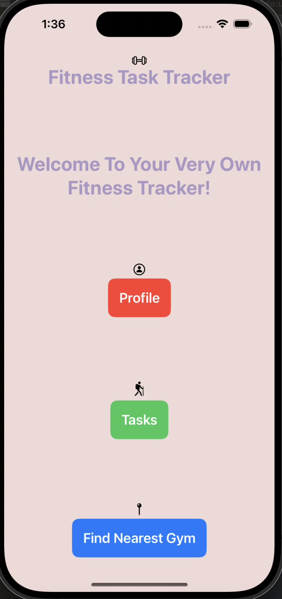
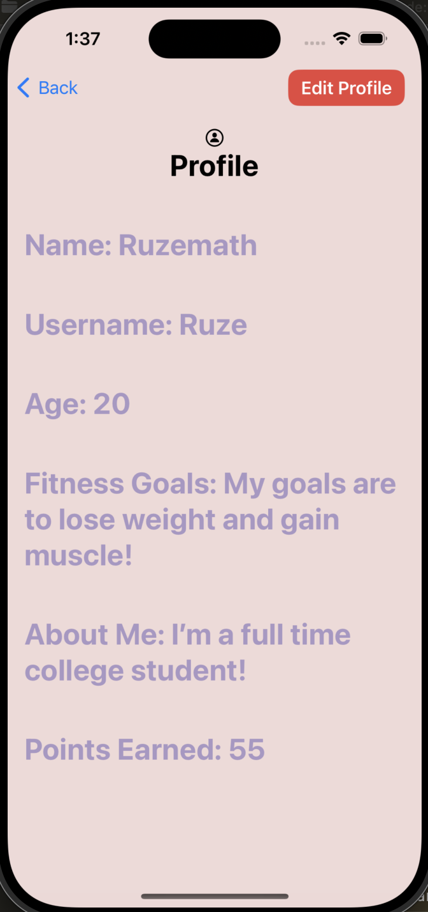
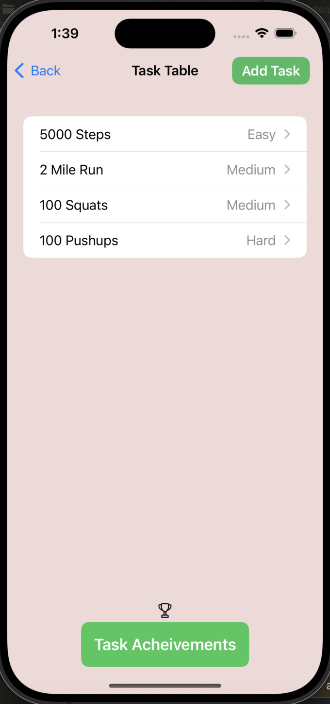
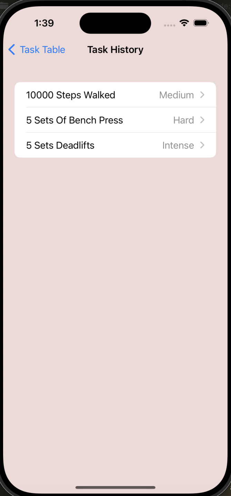
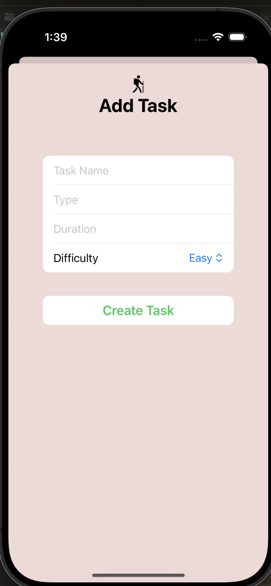
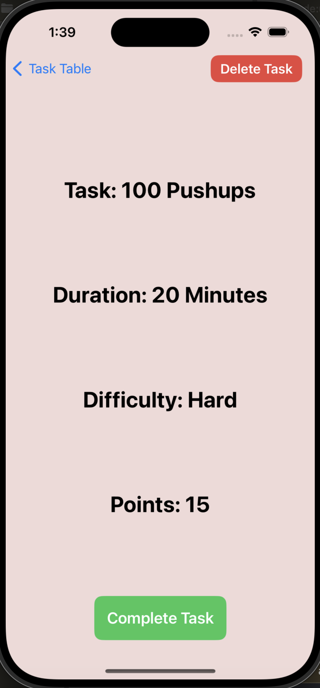
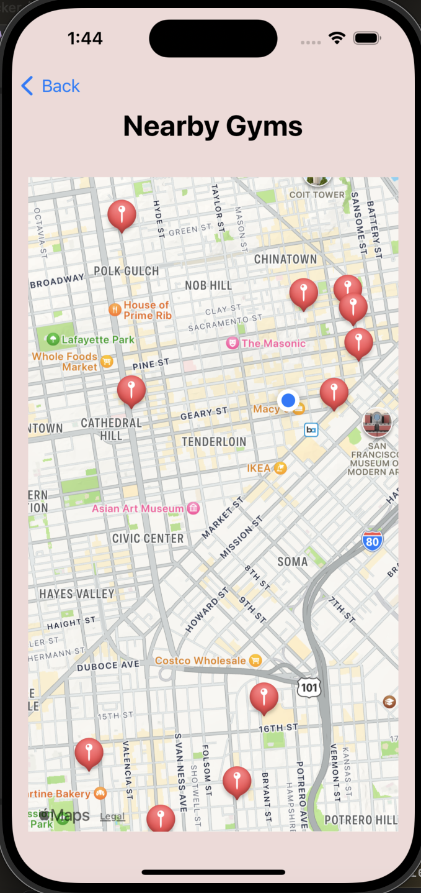

# Fitness Task Tracker

## Overview
**Fitness Task Tracker** is a Swift-based iOS application designed to help users manage their fitness routines effectively. The app allows users to track their fitness tasks, view progress, earn points, create a user profile, and locate nearby gyms.  
The application is built using **Model-View-ViewModel (MVVM)** architecture, ensuring a clean separation of layers where the user interface (UI), data, and logic are separated to ensure better reusability and functionality. 

## Features
* User Profile 
  - View Profile
  - Edit Profile

* Fitness Tasks
  - Set Tasks
  - View Ongoing Tasks
  - Delete Tasks
  - Complete Tasks
  - View Task History

* Points
  - Accumulate Points Based On Task Completion

* Find Gyms Nearby
  - View Nearest Gyms Based On Your Current Location

## Screenshots

  
  

    <h3>Main Menu and User Profile</h3>
    

        
        
    

  

  

    <h3>Current Tasks and Task History/Log</h3>
    

        
        
    

  

  

    <h3>Adding A Task and Example Task</h3>
    

        
        
    

  

  

    <h3>Nearby Gyms</h3>
    

        
    

  

